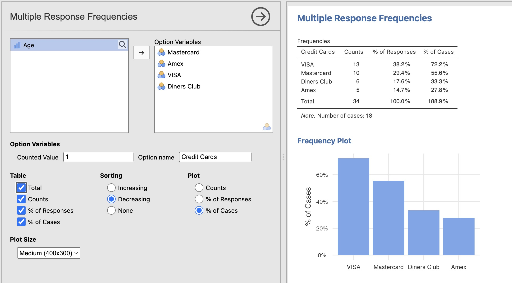
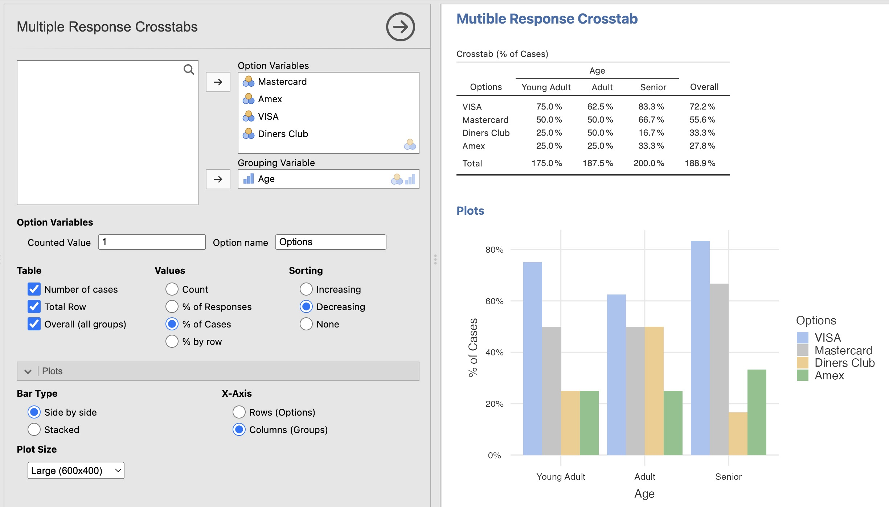

# vijMR

[jamovi](https://jamovi.org) module to analyse multiple response questions, using table and bar chart.

## Version history

### 2026-01-30

-  This module is not updated anymore. Multiple Response is now available in [vijPlots](https://github.com/vjalby/vijPlots).
  
### 2024-10-11, 2.1.0

-   add french translation

### 2024-09-02, 2.0.0

-   add crosstab method

### 2024-04-25 1.0.1

-   initial release
